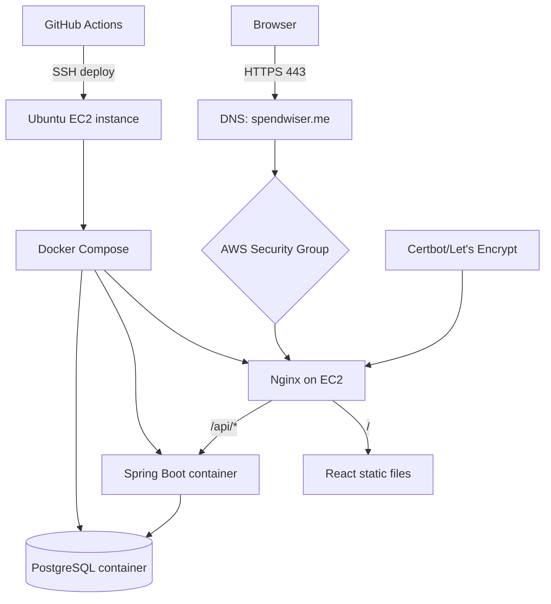
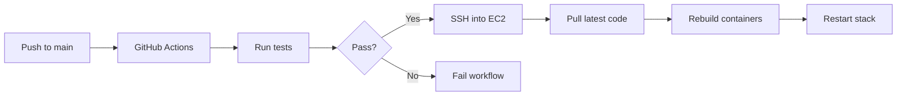

# Expense Tracking — DevOps Technical Reference

> **Audience:** Developers, DevOps learners, technical leads
> **Last Updated:** 2026-05-12
> **Stack:** AWS EC2 · Ubuntu · Docker · Docker Compose · Nginx · Certbot · GitHub Actions · Git/JWT · PostgreSQL 16

---

## Table of Contents

1. [Scope](#scope)
2. [Current DevOps Architecture](#current-devops-architecture)
3. [Infrastructure Decisions](#infrastructure-decisions)
4. [Server Setup](#server-setup)
5. [Containerization](#containerization)
6. [Nginx & HTTPS](#nginx--https)
7. [DNS & Domain Routing](#dns--domain-routing)
8. [Security Model](#security-model)
9. [CI/CD Pipeline](#cicd-pipeline)
10. [Deployment Flow](#deployment-flow)
11. [Operational Tasks](#operational-tasks)
12. [Troubleshooting](#troubleshooting)
13. [Current Limitations](#current-limitations)
14. [Next Steps](#next-steps)

---

## Scope

This document covers the DevOps work completed for the Expense Tracker project:

- AWS EC2 server provisioning
- Ubuntu server setup
- Docker and Docker Compose deployment
- Nginx reverse proxy setup
- HTTPS certificates with Certbot / Let's Encrypt
- DNS routing for `spendwiser.me`
- Security Groups and network exposure
- GitHub Actions CI/CD deployment
- Swap configuration for low-memory instances
- Operational commands and troubleshooting

It is both a **deployment record** and a **learning reference**.

---

## Current DevOps Architecture



### Service Layout

| Service | Role | Exposed | Notes |
|---------|------|---------|-------|
| Nginx | Reverse proxy, static hosting, HTTPS termination | Yes | Public entry point |
| Spring Boot | API backend | No | Internal only |
| PostgreSQL | Database | No | Internal only, persisted via volume |
| GitHub Actions | CI/CD automation | N/A | Triggers on push to `main` |

---

## Infrastructure Decisions

### Why AWS EC2?

| Choice | Why |
|--------|-----|
| **EC2** | Full control over the server, low cost, good learning value |
| **Ubuntu** | Familiar Linux distribution, strong package support |
| **t2.micro** | Cheap, enough for a small personal project, free-tier friendly |
| **Single instance** | Simpler than multi-node orchestration for current scale |

### Why Docker?

Docker solves the classic deployment problem:

- same app, different machine
- dependency drift
- manual setup on every server
- unclear runtime environment

Containers make the backend and database reproducible.

### Why Nginx?

Nginx handles the public edge:

- serves the frontend
- proxies API requests
- terminates HTTPS
- keeps backend private

### Why GitHub Actions?

GitHub Actions gives you automated deployment without needing a separate CI server.

---

## Server Setup

### Base Setup Steps

1. Launch EC2 instance
2. Select Ubuntu
3. Add Security Group rules
4. SSH into the instance
5. Update packages
6. Install Docker
7. Add the user to the docker group
8. Add swap for memory pressure

### Commands Used

```bash
sudo apt update && sudo apt upgrade -y
curl -fsSL https://get.docker.com | sudo sh
sudo usermod -aG docker $USER
sudo fallocate -l 2G /swapfile
sudo chmod 600 /swapfile
sudo mkswap /swapfile
sudo swapon /swapfile
echo '/swapfile none swap sw 0 0' | sudo tee -a /etc/fstab
```

### Why Swap Was Needed

The instance is small, so Docker builds and Java processes can exceed available RAM. Swap prevents the system from killing processes during build or startup.

---

## Containerization

### Runtime Model

The app runs as four containers managed by Docker Compose:

- `database` — PostgreSQL 16, persisted via Docker volume
- `backend` — Spring Boot JAR, built from multi-stage Maven Dockerfile
- `nginx` — Multi-stage Node build + Nginx, serves React static files, proxies `/api` to backend
- `certbot` — Standalone container for Let's Encrypt certificate management

---

## Nginx & HTTPS

### Nginx Role

Nginx is the public-facing web server.

It:
- listens on ports 80 and 443
- redirects HTTP to HTTPS
- serves the React build output
- proxies `/api/*` to the backend container
- applies security headers

### HTTPS Setup

Certbot is used with Let's Encrypt to obtain and renew certificates.

Certificate files are mounted into Nginx from the host:

```bash
/etc/letsencrypt/live/spendwiser.me/fullchain.pem
/etc/letsencrypt/live/spendwiser.me/privkey.pem
```

---

## Configuration Reference / Environment Variables

| Variable | Required | Purpose |
|----------|----------|---------|
| `DB_URL` | Prod | PostgreSQL JDBC URL |
| `DB_USERNAME` | Prod | Database user |
| `DB_PASSWORD` | Prod | Database password |
| `JWT_SECRET` | Prod | HS256 signing key |
| `PLAID_CLIENT_ID` | Bank Features | Plaid API Client ID |
| `PLAID_SECRET` | Bank Features | Plaid API Secret |
| `PLAID_ENV` | Bank Features | Plaid environment (`sandbox`, `development`, `production`) |
| `PLAID_WEBHOOK_URL`| Bank Features | Public URL for Plaid to send events (e.g., `https://spendwiser.me/api/banks/webhook`) |

---

## CI/CD Pipeline

### Current Flow



### Secrets Used

| Secret | Purpose |
|--------|---------|
| `EC2_HOST` | Server public IP address |
| `EC2_USER` | SSH username (e.g. `ubuntu`) |
| `EC2_SSH_KEY` | Private SSH key for authentication |
| `ENV_FILE` | Full `.env` file content — rewritten on every deploy |

---

## Deployment Flow

### What Happens on the Server

```bash
git pull
cat << 'ENVEOF' > .env
${{ secrets.ENV_FILE }}   # written by pipeline — contains real DB/JWT/Plaid credentials
ENVEOF
docker compose build
docker compose up -d
docker image prune -f
```

The `.env` is fully rewritten on every deploy — the server never holds persistent secrets.

---

## Troubleshooting

### Common Issues

| Problem | Likely Cause | Fix |
|---------|--------------|-----|
| `502 Bad Gateway` | Backend down or wrong proxy target | Check backend container and `proxy_pass` |
| `Connection timeout` | Security Group or service not running | Check ports and service status |
| `Permission denied` on SSH | Wrong key permissions | `chmod 400 key.pem` |
| Low memory | t2.micro limits | Add swap or scale instance |
| SSL renewal fails | DNS/port 80 issue | Verify domain and open port 80 |

### Debug Order

1. Check containers
2. Check logs
3. Check ports
4. Check Security Groups
5. Check DNS
6. Check certificates
