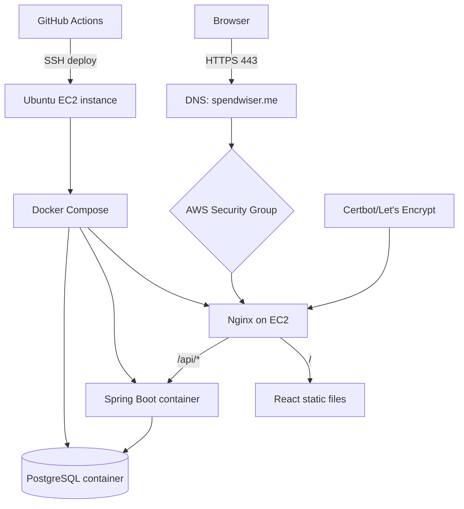

# Expense Tracking — DevOps Technical Reference

> **Audience:** Developers, DevOps learners, technical leads
> **Last Updated:** 2026-05-13
> **Stack:** AWS EC2 · Ubuntu · Docker · Docker Compose · Nginx · Certbot · GitHub Actions · Git/JWT · PostgreSQL 16

---

## Table of Contents

1. [Scope](#scope)
2. [[#Current DevOps Architecture]]
3. [[#Infrastructure Decisions]]
4. [[#Server Setup]]
5. [[#Containerization]]
6. [[#Nginx and HTTPS]]
7. [[#Automated TLS and SSL Management]]
8. [[#Configuration and Environment Variables]]
9. [[#CI/CD Pipeline and Deployment]]
10. [[#Monitoring and Self-Healing]]
11. [[#Automated Maintenance]]
12. [Troubleshooting](#troubleshooting)

---

## Scope

This document covers the DevOps work completed for the Expense Tracker project:

- AWS EC2 server provisioning
- Ubuntu server setup
- Docker and Docker Compose deployment
- Nginx reverse proxy setup
- HTTPS certificates with Certbot / Let's Encrypt
- DNS routing for `spendwiser.me`
- Security Groups and network exposure
- GitHub Actions CI/CD deployment
- Automated monitoring, alerting (Telegram), and self-healing (cron + Bash)
- Swap configuration for low-memory instances
- Plaid Open Banking integration configuration
- Operational commands and troubleshooting

---

## Current DevOps Architecture



### Service Layout

| Service | Role | Exposed | Notes |
|---------|------|---------|-------|
| Nginx | Reverse proxy, static hosting, HTTPS termination | Yes | Public entry point |
| Spring Boot | API backend | No | Internal only |
| PostgreSQL | Database | No | Internal only, persisted via volume |
| Certbot | SSL manager | No | Invoked by startup scripts/cron |
| GitHub Actions| CI/CD automation | N/A | Triggers on push to `main` |

---

## Infrastructure Decisions

### Why AWS EC2?

| Choice | Why |
|--------|-----|
| **EC2** | Full control over the server, low cost, good learning value |
| **Ubuntu** | Familiar Linux distribution, strong package support |
| **t2.micro** | Cheap, enough for a small personal project, free-tier friendly |
| **Single instance** | Simpler than multi-node orchestration for current scale |

### Why Docker?

Docker solves the classic deployment problem:

- same app, different machine
- dependency drift
- manual setup on every server
- unclear runtime environment

Containers make the backend and database reproducible.

### Why Nginx?

Nginx handles the public edge:

- serves the frontend
- proxies API requests
- terminates HTTPS
- keeps backend private

### Why GitHub Actions?

GitHub Actions gives you automated deployment without needing a separate CI server.

---

## Server Setup

### Base Setup Steps

1. Launch EC2 instance
2. Select Ubuntu
3. Add Security Group rules (Port 80, 443, 22)
4. SSH into the instance
5. Update packages
6. Install Docker
7. Add the user to the docker group
8. Add swap for memory pressure

### Commands Used

```bash
sudo apt update && sudo apt upgrade -y
curl -fsSL https://get.docker.com | sudo sh
sudo usermod -aG docker $USER
sudo fallocate -l 2G /swapfile
sudo chmod 600 /swapfile
sudo mkswap /swapfile
sudo swapon /swapfile
echo '/swapfile none swap sw 0 0' | sudo tee -a /etc/fstab
```

### Why Swap Was Needed

The instance is small, so Docker builds and Java processes can exceed available RAM. Swap prevents the system from killing processes during build or startup.

---

## Containerization

### Runtime Model

The app runs as four containers managed by Docker Compose:

- `database` — PostgreSQL 16, persisted via Docker volume
- `backend` — Spring Boot JAR, built from multi-stage Maven Dockerfile
- `nginx` — Multi-stage Node build + Nginx, serves React static files, proxies `/api` to backend, uses `envsubst` for dynamic TLS domains.
- `certbot` — Standalone container for Let's Encrypt certificate management

---

## Nginx and HTTPS

### Nginx Role

Nginx is the public-facing web server.

It:
- listens on ports 80 and 443
- redirects HTTP to HTTPS
- serves the React build output
- proxies `/api/*` to the backend container
- applies security headers

### HTTPS Setup

Certificate files are mounted into Nginx from the host:

```bash
/etc/letsencrypt/live/spendwiser.me/fullchain.pem
/etc/letsencrypt/live/spendwiser.me/privkey.pem
```

---

## Automated TLS and SSL Management

TLS certificates are bootstrapped automatically via `script/bootstrap-tls.sh` which is called during deployment.

**Features of the Bootstrap Script:**
- **Idempotency:** It skips generation if a valid cert (>30 days remaining) exists.
- **Nginx Survival:** It first generates a dummy self-signed cert so Nginx can start up without crashing. Once Nginx is ready, it issues the real Let's Encrypt cert and gracefully reloads Nginx.

SSL expiration is tracked continuously by `monitor.sh` (see Monitoring below).

---

## Configuration and Environment Variables

| Variable | Required | Purpose |
|----------|----------|---------|
| `DB_URL` | Prod | PostgreSQL JDBC URL |
| `DB_USERNAME` | Prod | Database user |
| `DB_PASSWORD` | Prod | Database password |
| `JWT_SECRET` | Prod | HS256 signing key |
| `TLS_DOMAIN` | Prod | Primary domain (e.g., `spendwiser.me`) |
| `LETSENCRYPT_EMAIL`| Prod | Contact email for SSL generation |
| `TELEGRAM_BOT_TOKEN`| Prod | Telegram bot token for alerting |
| `TELEGRAM_CHAT_ID` | Prod | Telegram chat ID for alerting |
| `PLAID_CLIENT_ID` | Bank | Plaid API Client ID |
| `PLAID_SECRET` | Bank | Plaid API Secret |
| `PLAID_ENV` | Bank | Plaid environment (`sandbox`, `development`, `production`) |
| `PLAID_WEBHOOK_URL`| Bank | Public URL for Plaid to send events (e.g., `https://spendwiser.me/api/banks/webhook`) |

*(Note: Plaid has fully replaced the legacy GoCardless integration as of db migrations V6/V7).*

---

## CI/CD Pipeline and Deployment

The deployment pipeline is fully automated via `.github/workflows/deploy.yml` triggered on push to `main`.

### The Flow:

1. **Build & Test:** A temporary PostgreSQL service is spun up. Maven builds and tests the Java backend. NPM builds the Vite React frontend.
2. **Deploy via SSH:** If tests pass, the action SSHes into EC2.
3. **Environment Injection:** Variables and secrets are securely injected into `.env`.
4. **Image Rebuild & TLS Bootstrap:** Docker images are rebuilt, and `script/bootstrap-tls.sh` ensures SSL validity.
5. **Container Boot:** `docker compose up -d` starts the system.
6. **Health Check Polling Loop:** The deploy script continuously polls `docker inspect` to ensure `nginx` and `backend` reach a `healthy` state. It aborts if a container falls into a restarting loop.
7. **Cron Installation:** `script/install-cron.sh` configures scheduled maintenance tasks.
8. **Smoke Tests:** `script/smoke-test.sh` executes against the live host. It verifies the Nginx HTTP 200 response and tests backend connectivity via `/api/auth/login`.
9. **Alerting:** Success or failure (with trailing logs) is broadcast to Telegram.

---

## Monitoring and Self-Healing

The `script/monitor.sh` runs every 5 minutes via cron (`/etc/cron.d/expense-monitor`) to guarantee system uptime.

### Active Checks:

1. **Java Heartbeat & Logs:**
   - Queries Spring Boot's `/actuator/health`. If the backend crashes or DB connection is lost, it instantly sends the last 30 error log lines to Telegram.
2. **Container Crash Remediation:**
   - Checks `docker compose ps` for failed containers and attempts auto-restart.
   - **Restart Loop Guard:** If the backend restarts more than 3 times in a 5-minute window (`/tmp/backend_restart.lock`), it aborts auto-restart and sends a `CRITICAL` Telegram alert to prevent further damage.
3. **Business Logic Monitoring (Plaid):**
   - Directly queries the PostgreSQL `sync_logs` table. If any background Plaid syncs have failed in the last 15 minutes, it sends the specific `plaid_item_id` and error message to Telegram.
4. **Disk Space Guard:**
   - Alerts Telegram if disk usage hits 85%. At 95%, it triggers extreme auto-pruning.
5. **SSL Tracking:**
   - A daily cron invokes `monitor.sh --ssl-check`. It sends Telegram warnings 30 days and 7 days prior to Let's Encrypt expiration.

---

## Automated Maintenance

To prevent EC2 disk exhaustion, a weekly cron job (Sundays at 4:00 AM) runs `monitor.sh --cleanup`:

- Automatically runs `docker system prune` and `docker container prune` targeting items older than 72 hours.
- Truncates oversized log files (`>100MB`) in `/var/log` down to 50MB.

---

## Troubleshooting

### Common Issues

| Problem | Likely Cause | Fix |
|---------|--------------|-----|
| `502 Bad Gateway` | Backend down or wrong proxy target | Check backend container logs and `proxy_pass` |
| `Connection timeout` | Security Group or service not running | Check ports and service status |
| `Permission denied` on SSH | Wrong key permissions | `chmod 400 key.pem` |
| Low memory | t2.micro limits | Add swap or scale instance |
| Plaid sync failing | Plaid credentials invalid | Check `.env` and `sync_logs` table via Telegram alerts |

### Debug Order

1. Check containers (`docker compose ps`)
2. Check logs (`docker compose logs --tail=100 backend`)
3. Check ports (`curl -I localhost`)
4. Check Security Groups (AWS Console)
5. Check DNS / Certificates (`openssl x509 -in ...`)