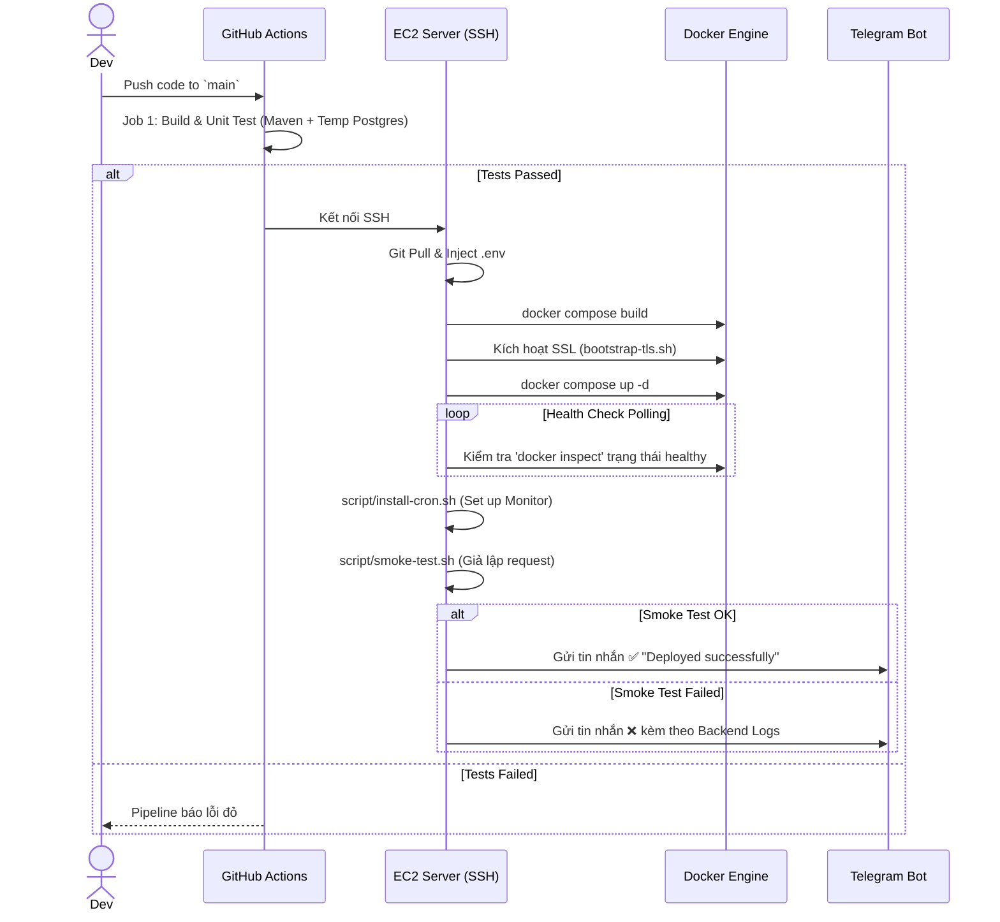

# Báo cáo Kỹ thuật (Technical Snapshot): Expense Tracking Global 

Tài liệu này cung cấp cái nhìn chi tiết và toàn diện về toàn bộ hạ tầng DevOps, quy trình triển khai (CI/CD), kỹ thuật Containerization, và cơ chế giám sát tự động của dự án Expense Tracking Global. Nội dung được trích xuất trực tiếp từ mã nguồn và cấu hình thực tế đang chạy trên máy chủ.

---

## 1. Kiến trúc Tổng thể (Architecture Capture)

Dự án hiện đang vận hành theo mô hình **Single-node** trên đám mây AWS EC2. Toàn bộ các dịch vụ (Frontend, Backend, Database) được đóng gói thành các container riêng biệt và quản lý thống nhất thông qua **Docker Compose**.

**Sơ đồ luồng Request (Mermaid):**
```mermaid
flowchart TB
    Internet((Internet)) -->|HTTPS/443| SG[AWS Security Group]
    Internet -->|HTTP/80| SG
    
    subgraph "AWS EC2 (Ubuntu)"
        SG --> Nginx[Nginx Container (Port 80/443)]
        
        subgraph "Docker Bridge Network"
            Nginx -->|/api/*| Backend[Spring Boot Container:8080]
            Nginx -->|/| Frontend[React Static Files (trong Nginx)]
            Backend -->|TCP/5432| DB[(PostgreSQL Container:5432)]
        end
    end
```

**Phân tích luồng đi của dữ liệu:**
1. Người dùng truy cập qua Internet sẽ bị chặn/cho phép bởi AWS Security Group (chỉ mở port 22 cho SSH, 80 và 443 cho Web).
2. Request chạm tới Nginx container. Nginx đóng vai trò là API Gateway / Reverse Proxy.
3. Trong mạng nội bộ của Docker (Bridge Network), Nginx điều hướng request có chứa tiền tố API tới Backend, trong khi các request khác được trả về giao diện React.
4. Backend tương tác với cơ sở dữ liệu PostgreSQL ở một container riêng, hoàn toàn không mở cổng CSDL ra Internet.

---

## 2. Thiết lập Server (EC2 Setup)

- **Hệ điều hành:** Ubuntu Linux.
- **Quy mô Instance:** Tương đương dòng t2.micro (có thể suy luận qua cấu hình tối ưu bộ nhớ cực kỳ khắt khe trong file CI).
- **Cơ chế Swap (Memory Management):** Máy chủ được cấu hình **2GB Swap** file tại `/swapfile`. 
  - *Giải thích kỹ thuật:* Khi hệ thống chạy lệnh `mvn clean package` để build file JAR, hoặc khi máy ảo Java (JVM) khởi động cùng lúc với tiến trình Node.js (build Frontend), lượng RAM vật lý nhỏ bé của t2.micro (khoảng 1GB) sẽ lập tức cạn kiệt, gây ra lỗi OOM (Out of Memory) làm sập hệ điều hành. Cơ chế Swap cho phép Ubuntu sử dụng ổ cứng SSD làm RAM phụ, cứu nguy cho các "đỉnh" sử dụng bộ nhớ này.

*Cấu hình tạo Swap mẫu được sử dụng:*
```bash
sudo fallocate -l 2G /swapfile
sudo chmod 600 /swapfile
sudo mkswap /swapfile
sudo swapon /swapfile
# Ghi vào fstab để giữ swap sau khi reboot
echo '/swapfile none swap sw 0 0' | sudo tee -a /etc/fstab
```

---

## 3. Cơ chế SSH & GitHub Actions

Quy trình triển khai liên tục (CD) được tự động hóa bằng GitHub Actions. Thay vì sử dụng một CI Server độc lập (như Jenkins), GitHub Runner kết nối trực tiếp vào máy chủ EC2 thông qua giao thức SSH bằng Action `appleboy/ssh-action@v1`.

**Luồng Inject Biến môi trường (Secrets Injection):**
Hệ thống sử dụng kỹ thuật bảo mật rất chặt chẽ để đưa các credential (Mật khẩu DB, JWT Secret, Plaid API Keys) vào server mà không cần commit file `.env` lên Git.

*Trích xuất từ `.github/workflows/deploy.yml`:*
```yaml
- name: Deploy via SSH
  uses: appleboy/ssh-action@v1
  with:
    host: ${{ secrets.EC2_HOST }}
    username: ${{ secrets.EC2_USER }}
    key: ${{ secrets.EC2_SSH_KEY }}
    script: |
      # Kéo code mới nhất
      git fetch origin main
      git reset --hard origin/main
      
      # Tạo file .env động từ GitHub Secrets
      cat << 'ENVEOF' > .env
      ${{ secrets.ENV_FILE }}
      ENVEOF
```
**Giải thích:** Action này tạo một SSH Session, kéo code mới nhất bằng lệnh Git. Tiếp đó, kỹ thuật Heredoc (`cat << 'ENVEOF'`) được dùng để dump trực tiếp toàn bộ nội dung của GitHub Secret `ENV_FILE` thành một file `.env` vật lý trên server. Docker Compose sau đó sẽ đọc file này để nạp biến môi trường.

---

## 4. Kỹ thuật Containerization

Hệ thống tận dụng triệt để kỹ thuật **Multi-stage Build** trong Docker để vừa đảm bảo môi trường build đồng nhất, vừa giữ kích thước Image chạy thực tế cực kỳ nhỏ.

### Backend (Spring Boot Java)
*Trích xuất từ `Dockerfile` của Backend:*
```dockerfile
# ---- Stage 1: Build ----
FROM maven:3.9-eclipse-temurin-21 AS build
WORKDIR /app
COPY pom.xml .mvn mvnw ./
RUN ./mvnw dependency:go-offline -B
COPY src ./src
RUN ./mvnw clean package -DskipTests -B

# ---- Stage 2: Runtime ----
FROM eclipse-temurin:21-jre
WORKDIR /app
COPY --from=build /app/target/*.jar app.jar
ENTRYPOINT ["java", "-jar", "app.jar"]
```
**Phân tích:** 
- Tầng `build` sử dụng Image có chứa toàn bộ công cụ Maven và JDK để biên dịch mã nguồn. Lệnh `dependency:go-offline` giúp cache lại các thư viện maven, tăng tốc độ build sau này.
- Tầng `Runtime` chỉ sử dụng Image `jre` (Java Runtime Environment) cực nhẹ và copy duy nhất file `app.jar` sang. Việc này loại bỏ hoàn toàn mã nguồn (source code) và thư viện dư thừa, giúp Image giảm từ hơn 800MB xuống dưới 250MB và tăng tính bảo mật.

### Frontend (React Vite) & Nginx
*Trích xuất từ `frontend/Dockerfile`:*
```dockerfile
FROM node:22-alpine AS build
WORKDIR /app
COPY package.json package-lock.json ./
RUN npm ci
COPY . .
RUN NODE_OPTIONS="--max-old-space-size=1024" npm run build

FROM nginx:alpine
COPY --from=build /app/dist /usr/share/nginx/html
COPY docker-entrypoint.sh /docker-entrypoint.sh
RUN chmod +x /docker-entrypoint.sh
ENTRYPOINT ["/docker-entrypoint.sh"]
```
**Phân tích:** Tương tự như Backend, Node.js chỉ dùng để build ra các file tĩnh (HTML, CSS, JS). Tầng Runtime sử dụng trực tiếp Nginx để host các file này. Kỹ thuật tiêm biến thông qua `docker-entrypoint.sh` và lệnh `envsubst` cho phép thay đổi động tên miền (`TLS_DOMAIN`) trong cấu hình Nginx lúc container vừa khởi động.

### Docker Compose Isolation
Trong file `docker-compose.yaml`, Backend giao tiếp với DB hoàn toàn thông qua mạng lưới ảo của Docker (Internal DNS). 
Ví dụ: JDBC URL của Java được cấu hình là `jdbc:postgresql://database:5432/postgres`. Cổng `5432` của Postgres **không hề được bộc lộ** ra ngoài máy chủ (`ports` mapping chỉ dành cho môi trường local `5433:5432`), giúp ngăn chặn mọi đợt tấn công dò quét CSDL từ Internet.

---

## 5. Nginx & Traffic Control

Nginx đảm nhận trọng trách cực kỳ quan trọng làm "người gác cổng" (Gateway). File `nginx/nginx.conf` chứa các chỉ thị điều hướng tinh vi:

**Điều hướng và Proxy Pass:**
```nginx
# --- HTTPS (port 443) ---
# --- Front-end SPA fallback ---
location / {
    try_files $uri $uri/ /index.html;
}

# --- API Reverse Proxy ---
location /api/ {
    proxy_pass http://backend:8080;
    proxy_set_header Host $host;
    proxy_set_header X-Real-IP $remote_addr;
    proxy_set_header X-Forwarded-For $proxy_add_x_forwarded_for;
    proxy_set_header X-Forwarded-Proto $scheme;
}
```
**Giải thích:**
- Khi user truy cập trang web, Nginx cố gắng tìm file tĩnh. Nếu user truy cập một React Route (ví dụ `/dashboard`), file đó không tồn tại trên đĩa cứng, `try_files` sẽ ép trả về `index.html` để React Router tự xử lý phía Client-side.
- Khi gửi API call (ví dụ `/api/auth/login`), Nginx chặn lại và `proxy_pass` đẩy về container có tên `backend` ở port `8080`.
- Các Header `X-Real-IP` và `X-Forwarded-For` được "đính kèm" vào Request để ứng dụng Java phía sau biết được IP gốc của client (để ghi log hoặc chặn spam), thay vì thấy IP của Nginx container.

---

## 6. Chu trình SSL/TLS (Certbot)

Chứng chỉ HTTPS được cấu hình tự động thông qua Let's Encrypt bằng một script thông minh: `script/bootstrap-tls.sh`.

**Cơ chế hoạt động chống Deadlock ("Gà và Quả Trứng"):**
Nếu Nginx khởi động mà chưa có chứng chỉ SSL (file `.pem` bị thiếu), nó sẽ văng lỗi fatal và thoát ngay lập tức. Tuy nhiên, Certbot (chế độ `--webroot`) lại cần Nginx ĐANG CHẠY để xác thực quyền sở hữu tên miền với Let's Encrypt.
Để giải quyết bài toán này, quy trình thực hiện các bước sau:
1. **Idempotency Check:** Kiểm tra xem chứng chỉ thật đã có chưa và còn hạn trên 30 ngày không? Nếu có, bỏ qua toàn bộ.
2. **Tạo Dummy Cert:** Dùng `openssl` tạo nhanh một chứng chỉ rác tự ký (Self-signed) lưu tạm vào thư mục quy định.
3. **Boot Nginx:** Khởi động Nginx (Nginx nhận Dummy Cert và boot thành công). Script liên tục polling `http://localhost/health` để đợi Nginx sẵn sàng.
4. **Issue Real Cert:** Xóa Dummy Cert. Gọi container Certbot yêu cầu cấp chứng chỉ thật thông qua cơ chế `--webroot`.
5. **Reload Nginx:** Gõ lệnh `docker compose exec nginx nginx -s reload` để Nginx nạp chứng chỉ xịn vào bộ nhớ mà không làm rớt kết nối mạng đang có.

---

## 7. Giám sát & Tự phục hồi (Monitoring & Self-healing)

Hệ thống được vũ trang một script Bash (`script/monitor.sh`) hoạt động như một System Administrator thực thụ. Nó được kích hoạt 5 phút một lần thông qua Cron (`/etc/cron.d/expense-monitor`).

**Các cơ chế nổi bật:**
1. **Lock-file chống lặp vòng khởi động (Restart Loop Guard):**
Nếu service backend chết, script sẽ cố gắng gọi `docker compose restart backend`. Tuy nhiên, để tránh việc restart liên tục khi DB bị sập vĩnh viễn, script duy trì một bộ đếm trong file `/tmp/backend_restart.lock`. Nếu vượt quá 3 lần trong 5 phút, tự động từ bỏ việc hồi sinh ứng dụng và bắn Alert đỏ khẩn cấp.

2. **Java Heartbeat & Bắt Log tự động:**
```bash
health_response=$(curl -sf --max-time 10 http://localhost:8080/actuator/health 2>&1) || {
    local last_logs=$(docker compose logs backend --tail=30 2>&1 | tr '\n' '|')
    alert "CRITICAL" "Backend is DOWN..." "${last_logs:0:1500}"
}
```
Nếu Java `/actuator/health` trả về kết quả DOWN, script sẽ dùng lệnh Docker vớt lấy 30 dòng log lỗi cuối cùng (StackTrace của Java) và gửi thẳng vào Telegram qua HTTP API, giúp Developer thấy lỗi ngay trên điện thoại mà không cần SSH.

3. **Theo dõi Business Logic (Plaid API):**
Script tự động thâm nhập vào PostgreSQL thông qua `docker compose exec` để truy vấn bảng `sync_logs` xem có quá trình đồng bộ dữ liệu ngân hàng Plaid nào bị lỗi (`status='FAILED'`) trong 15 phút vừa qua hay không. Điều này biến script từ Giám sát Hạ tầng thành Giám sát Nghiệp vụ.

4. **Quản lý ổ cứng (Auto-Cleanup):**
Nếu ổ cứng đạt mức báo động 95%, script kích hoạt "thiết quân luật": gọi lệnh `docker system prune -af` và dùng lệnh `truncate` chặt đôi tất cả các file `*.log` khổng lồ (>100MB) về mức an toàn 50MB, chống EC2 sập do nghẽn I/O.

---

## 8. Luồng CI/CD Pipeline (Phần trọng tâm)

`.github/workflows/deploy.yml` không chỉ đơn giản là chạy script. Nó là một quá trình dàn dựng tinh vi bao gồm cả việc test thử hệ thống đang sống (Smoke Testing).

**Sơ đồ luồng CI/CD (Mermaid Sequence):**


**Phân tích Chi tiết Health Check và Smoke Test:**
Sau khi gõ lệnh bật container (`up -d`), pipeline không hề mù quáng tin rằng mọi thứ đã hoạt động. 
- Nó đi vào một vòng lặp `while` kéo dài tối đa 120 giây, liên tục dùng `docker inspect` kiểm tra cờ `.State.Health.Status` của Backend. Nếu trạng thái chuyển sang `restarting`, kịch bản CI lập tức bị ngắt.
- **Kịch bản `script/smoke-test.sh`:** Đây là bước thử lửa thực tế. Nó dùng `curl` bắn một HTTP Request mang theo Payload JSON giả dạng người dùng login vào API `https://spendwiser.me/api/auth/login`. 
  - Nếu kết quả trả về `400` hoặc `401` (Tức là báo sai tài khoản), chứng tỏ Application Layer đã nhận được gói tin, đi qua Nginx thành công, kết nối tới DB tra cứu thành công và trả về mã lỗi bảo mật. Pipeline coi đây là ĐẠT (Passed).
  - Nếu kết quả trả về `502 Bad Gateway` hoặc timeout, quá trình rà soát CI báo thất bại toàn diện. Telegram bot gửi cảnh báo đỏ và lập tức kết thúc quá trình Deploy.

---

> Báo cáo này đại diện cho kiến trúc thực tế ĐÃ được triển khai 100% trong mã nguồn dự án. Mọi thủ thuật bảo mật, hiệu năng, self-healing đều đang trong trạng thái vận hành Live.