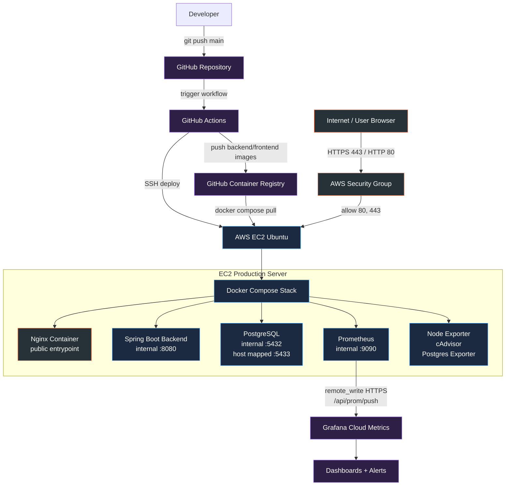
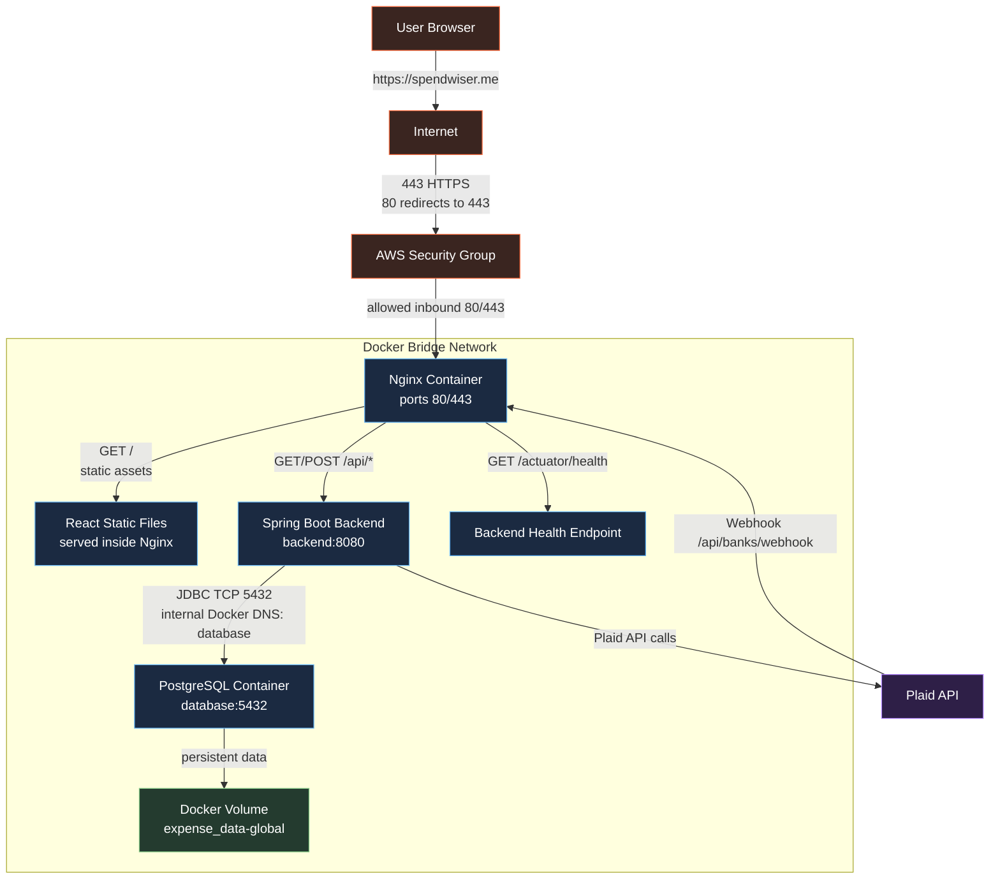
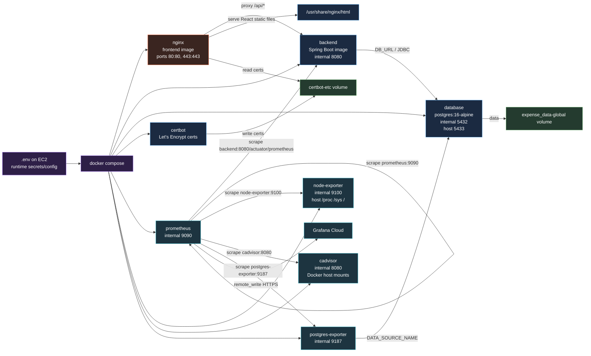
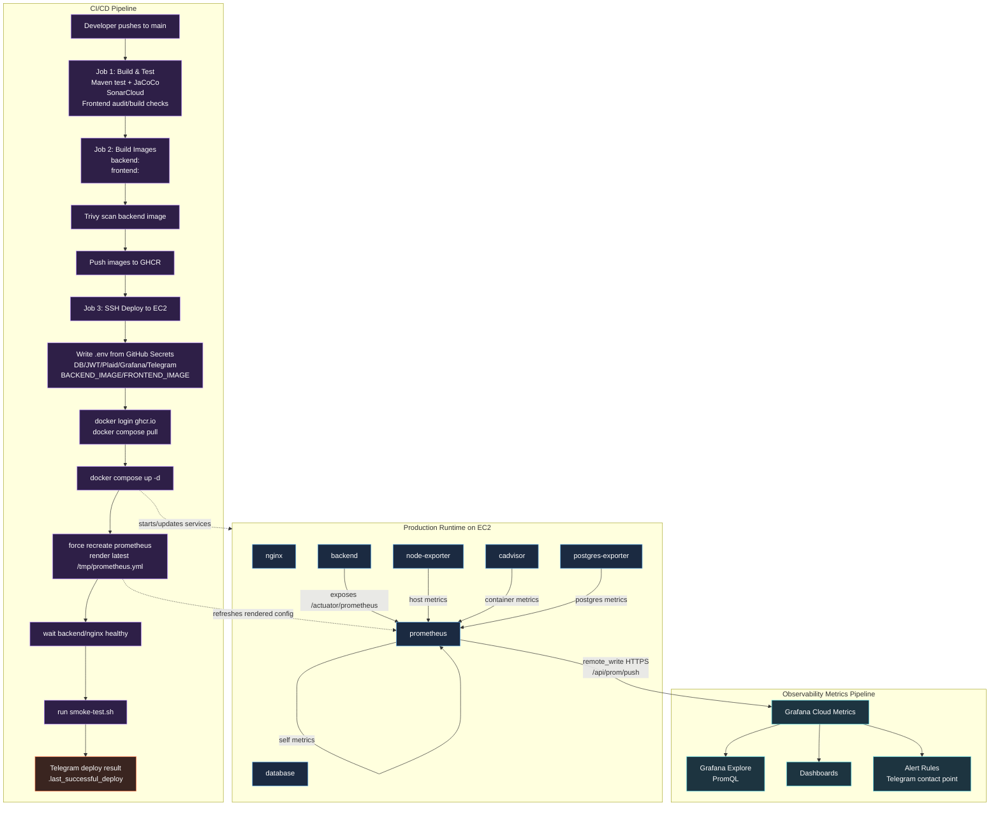

# Phase 2 Diagram Drafts

File nay la ban nhap de hinh dung kien truc truoc khi ve lai chi tiet hon bang Excalidraw, Figma, Draw.io, hoac cong cu ve so do khac.

Muc tieu cua 4 so do:

1. Nhin tong quan he thong production.
2. Hieu duong di cua user request.
3. Hieu Docker Compose dang chay cac container nao va container nao noi chuyen voi nhau.
4. Hieu pipeline CI/CD va observability metrics flow.

---

## 1. Big Picture Production Architecture

So do nay dung de giai thich buc tranh lon: user, GitHub/GHCR, EC2, Docker Compose, Grafana Cloud.



### Diem can nhan manh khi ve lai

- User chi di vao EC2 qua `80/443`.
- Nginx la public entrypoint duy nhat cho web traffic.
- Backend, Prometheus, exporters nam trong Docker network, khong can public ra internet.
- GitHub Actions push image len GHCR; EC2 pull image tu GHCR.
- Prometheus khong bi Grafana Cloud scrape truc tiep. Prometheus push metrics ra ngoai bang HTTPS.

---

## 2. Runtime Request Flow

So do nay dung de giai thich duong di cua user khi su dung ung dung.



### Diem can nhan manh khi ve lai

- `/` va `/assets/*` tra ve React SPA tu Nginx.
- `/api/*` duoc Nginx reverse proxy sang backend.
- Backend noi chuyen voi Postgres bang service name `database`, khong di qua internet.
- Plaid webhook la external callback di vao lai qua Nginx roi toi backend.
- Nen danh dau `PostgreSQL 5433:5432` la host mapping can duoc bao ve bang AWS Security Group.

---

## 3. Docker Compose Internal Services

So do nay dung de zoom-in vao ben trong EC2: moi service trong Docker Compose co vai tro gi, doc env nao, expose/call cai nao.



### Diem can nhan manh khi ve lai

- `.env` la cau noi giua GitHub Secrets va Docker Compose runtime.
- Docker Compose inject env vao container qua `environment`.
- Nginx la container duy nhat publish `80/443`.
- Backend khong publish port ra host, chi duoc Nginx va Prometheus goi qua Docker network.
- Prometheus config that su chay trong container la `/tmp/prometheus.yml`, duoc render tu template luc container start.
- `postgres-exporter` doc DB bang user/pass tu `.env`, roi bien DB health thanh metrics.

---

## 4. CI/CD And Observability Flow

So do nay ket hop hai pipeline khac nhau nhung nen ve tach lane ro rang:

- Deployment pipeline: code -> image -> EC2.
- Metrics pipeline: exporters -> Prometheus -> Grafana Cloud.



### Diem can nhan manh khi ve lai

- Deployment pipeline va metrics pipeline la hai dong khac nhau.
- CI/CD chi chay khi push code/deploy.
- Observability chay lien tuc moi 30 giay.
- `docker compose up -d` cap nhat service.
- `docker compose up -d --no-deps --force-recreate prometheus` dam bao Prometheus render lai config moi nhat.
- Grafana Cloud khong can inbound access vao EC2.
- Alert cua Grafana dua tren metrics, khac voi cron monitor/Telegram script cua Phase 1.

---

## Goi Y Khi Ve Lai Bang Excalidraw/Figma

Nen dung quy uoc mau nhat quan:

| Mau | Y nghia |
|---|---|
| Cam / do | Public internet, public port, security boundary |
| Xanh duong | Internal app/container traffic |
| Xanh la | Database, volume, persistent data |
| Tim | Secrets, env vars, GitHub Actions |
| Cyan | Metrics, Prometheus, Grafana |

Nen dung 3 kieu mui ten:

| Mui ten | Y nghia |
|---|---|
| Mui ten lien | Request/runtime traffic |
| Mui ten dut | Deploy/control action |
| Mui ten xanh/cyan | Metrics scrape/remote write |

Nen co label tren moi mui ten:

- `HTTPS 443`
- `HTTP 80 -> 443`
- `/api/*`
- `JDBC 5432`
- `scrape 30s`
- `remote_write /api/prom/push`
- `docker compose pull`
- `docker compose up -d`

---

## Canh Bao Kien Truc Can Ghi Nho

Hien tai Nginx co proxy:

```text
/actuator/ -> backend:8080
```

Va Spring Security permit:

```text
/actuator/prometheus
```

Dieu nay co nghia la neu Nginx cho public `/actuator/`, thi endpoint Prometheus metrics co the truy cap tu internet qua domain.

Khi ve so do production chuan, nen the hien mong muon cuoi cung la:

```text
/actuator/prometheus: internal Prometheus only
/actuator/health: public or semi-public health check
```

Day la mot diem hardening nen xu ly rieng sau khi hoan tat dashboard/alert.
